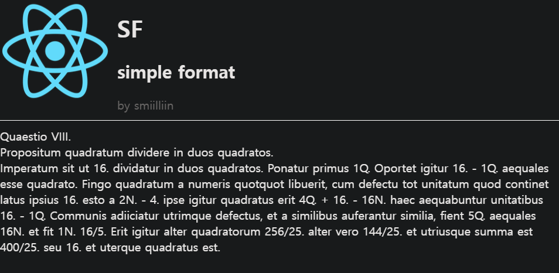
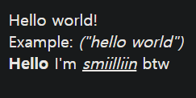
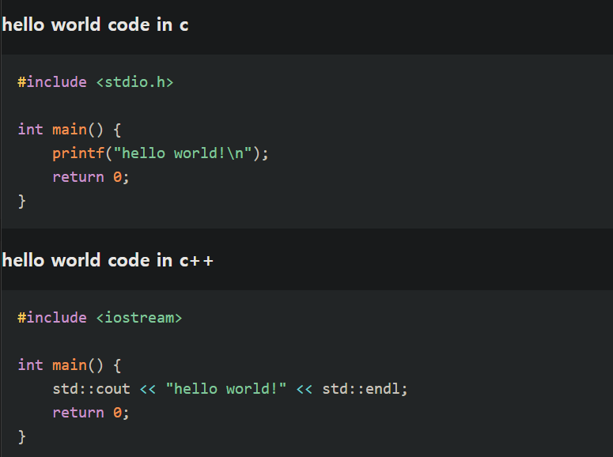

# SF - simple format

Create simple screens with simple text format.

## Install

Install modules

```bash
npm install prismjs
npm install -D @types/prismjs
```

## Run

```bash
npm run start
```

## Usage

A command consists of tags, data and some options.

```
[tag] [data] [option key1]=[option data1], [option key2]=[option data2] (...);

link "https://google.com" href="https://google.com";
```

If you wanna use normal text, you can use it without its tag.

```
[data] [options];

"normal text";
"normal text2" mtop="10px";
```

You can write data in multiple lines.

```
"asdf
ffff
hi";

"
hello
every
body
";
```

You can also write in tag, data, options multiple lines.

```
text "asdf"
mleft=10, color="gray";
```

**If you use a new line after tag, you must use "\\"**

```
text \
"asdf" mleft=10;
```

# Tags

| Name    | Data             | Options                 | When to use                |
| ------- | ---------------- | ----------------------- | -------------------------- |
| text    | format data      | -                       | format text                |
| -       | (same text tag)  | -                       | -                          |
| p       | text data        | -                       | a line text with margin    |
| span    | text data        | -                       | inline text                |
| big     | text data        | -                       | h1                         |
| middle  | text data        | -                       | h2                         |
| small   | text data        | -                       | h3                         |
| img     | image src        | alt                     | to show image              |
| a       | text data        | href, underline, newtab | link                       |
| link    | (same a tag)     | -                       | -                          |
| divider | border top       | -                       | to divide contents         |
| bg      | background color | -                       | to change background color |
| cstart  | squence name     | -                       | open container             |
| cend    | squence name     | -                       | close container            |

# Style

| Name      | Usage          |
| --------- | -------------- |
| mtop      | margin-top     |
| mbottom   | margin-bottom  |
| mleft     | margin-left    |
| mright    | margin-right   |
| ptop      | padding-top    |
| pbottom   | padding-bottom |
| pleft     | padding-left   |
| pright    | padding-right  |
| border    | border         |
| bradius   | border-radius  |
| color     | color          |
| cursor    | cursor         |
| blend     | mix-blend-mode |
| width     | width          |
| height    | height         |
| mwidth    | max-width      |
| mheight   | max-height     |
| display   | display        |
| position  | position       |
| float     | float          |
| wordwrap  | word-wrap      |
| wordbreak | word-break     |
| size      | font-size      |
| weight    | font-weight    |
| family    | font-family    |

## Example

```
bg "#181a1b";
img "./react.png" alt="icon", float="left", height="150px", mright="10px";
big "SF" color="white", blend="difference";
middle "simple format" color="white", blend="difference";
a "by smiilliin" href="https://github.com/smiilliin", underline=false, newtab=true, color="gray", blend="difference";
divider "1px solid white" mtop=10;
"Quaestio VIII.
Propositum quadratum dividere in duos quadratos.
Imperatum sit ut 16. dividatur in duos quadratos. Ponatur primus 1Q. Oportet igitur 16. - 1Q. aequales esse quadrato. Fingo quadratum a numeris quotquot libuerit, cum defectu tot unitatum quod continet latus ipsius 16. esto a 2N. - 4. ipse igitur quadratus erit 4Q. + 16. - 16N. haec aequabuntur unitatibus 16. - 1Q. Communis adiiciatur utrimque defectus, et a similibus auferantur similia, fient 5Q. aequales 16N. et fit 1N. 16/5. Erit igitur alter quadratorum 256/25. alter vero 144/25. et utriusque summa est 400/25. seu 16. et uterque quadratus est." color="white", mtop="10px", blend="difference";
```



```
"Hello world!
Example: \I(\"hello world\")\I" mleft=10, mtop=10;
"\BHello\B I'm \U\Ismiilliin\I\U btw" mleft=10;
```



```
small "hello world code in c";

code "#include <stdio.h>

int main() {
	printf(\"hello world!\\n\");
	return 0;
}" lang="cpp";

small "hello world code in c++";

code "#include <iostream>

int main() {
	std::cout << \"hello world!\" << std::endl;
	return 0;
}" lang="cpp";
```


